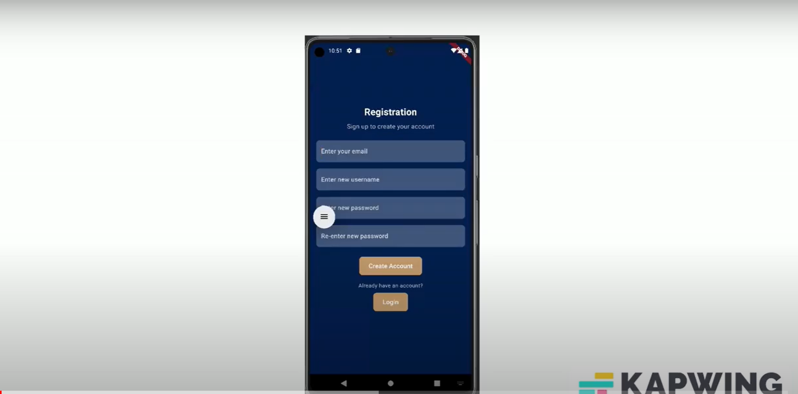

# IoT Coffee Machine Controller

## Overview

This project involves a mobile application designed to control an IoT-enabled coffee machine. The application features a modern frontend developed with Flutter and a robust Flask backend, utilizing SQLite for database management. The core functionality of the coffee machine is driven by an ESP32 module, programmed in C++ to handle operations like brewing control and status monitoring.

Security and reliability are ensured with TCP sockets using SSL/TLS protocols to link the backend with the coffee machine, and HTTPS to connect the frontend with the backend.

## Architecture

- **Frontend**: Built using Flutter, providing a user-friendly interface for controlling the coffee machine.
- **Backend**: Developed with Flask, handling API requests and communicating with the SQLite database and the coffee machine.
- **Database**: SQLite is used for storing user data and coffee machine states.
- **Coffee Machine Control**: An ESP32 embedded within the coffee machine runs custom C++ code, facilitating real-time operations and responses.
- **Communication**:
  - Backend to Coffee Machine: Secure TCP sockets with SSL/TLS.
  - Frontend to Backend: Secured with HTTPS.

## Future Improvements

We plan to expand the capabilities of our application by integrating an IoT sprinkler system, which will also be controlled through the mobile app. This addition will allow users to manage both coffee brewing and garden watering schedules seamlessly from the same platform, enhancing the smart home experience.

## Getting Started

These instructions will get you a copy of the project up and running on your local machine for development and testing purposes.

### Prerequisites

- Android Studio
- Python 3.x
- Flutter SDK
- An ESP32 module within your coffee machine (already set up and programmed)

### Installation

1. **Install Python Packages**

   Ensure you have Python installed, then set up the Flask environment and dependencies:

   ```bash
   pip install Flask Flask-SQLAlchemy Flask-Bcrypt

2. **Install Flutter**

   Follow the official Flutter installation guide to set up Flutter on your system.

3. **Set up Android Studio**
   
   Download and install Android Studio from the official site. Follow the setup wizard to install the necessary SDK tools.

## Running the Application

1. **Launch the Backend Server**

   Navigate to the backend directory and start the Flask server:

   ```bash
   cd onsync_backend
   python app.py

2. **Launch the Frontend Application**
   
   Navigate to the frontend directory and run the Flutter application:

   ```bash
   cd onsync_frontend
   flutter run

  Ensure an emulator is running in Android Studio or a device is connected to your computer.

3. **Accessing the Mobile Application**

   Open the mobile application in Android Studio. The application should connect to the backend server running locally.

# Demo 
  To watch the video demonstration of the running application: 
  [](https://www.youtube.com/watch?v=7K8jQHahWbs)
